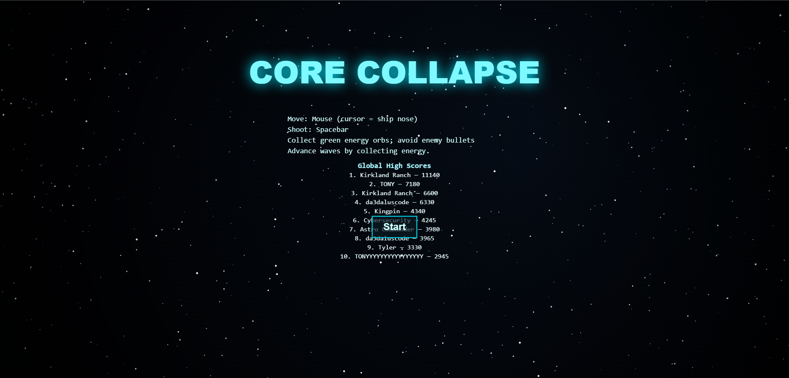

# CORE COLLAPSE

Arcade-style space shooter for the browser. Move with the mouse (cursor = ship nose), shoot with the spacebar, collect green energy to advance waves, and survive boss fights.

**Live:** https://da3daluscode.github.io/core-collapse/  
**Global Leaderboard API:** Cloudflare Worker (KV-backed)



---

## Features
- Responsive mouse-nose ship control, exhaust trails, and screen shake
- Enemy types (chaser, sniper, zig-zag, mines) and **boss every 5th wave**
- Power-ups (rapid, spread, pierce, shield)
- Wave formations + inter-wave pause, longer progression pacing
- Local scores and **global high scores** via Cloudflare Workers KV
- Runs fully from a single `index.html` (no build step)

## Controls
- **Move:** Mouse (cursor is the ship’s nose)
- **Shoot:** Spacebar

## Tech Stack
- HTML5 Canvas + vanilla JS
- GitHub Pages (static hosting)
- Cloudflare Workers + KV (global leaderboard storage)

## Project Structure
```text
core-collapse/
├─ index.html              # game + UI in one file
├─ docs/
│  ├─ cover.png            # screenshots for README
│  └─ demo.gif             # (optional) short gameplay loop
└─ .github/
   ├─ ISSUE_TEMPLATE/
   │  ├─ bug_report.yml
   │  └─ feature_request.yml
   └─ PULL_REQUEST_TEMPLATE.md
```

## Run Locally
Open `index.html` in a modern browser.  
Tip: In VS Code, the “Live Server” extension gives auto-reload.

## Deploy (GitHub Pages)
Pushing to `main` publishes to: `https://da3daluscode.github.io/core-collapse/`.

## Leaderboard API
- **Endpoint base:** `https://core-collapse-leaderboard.colours256.workers.dev`
- **GET** `/scores?limit=10` → JSON array of top scores
- **POST** `/scores` with JSON body:
  ```json
  { "name":"Player", "score":1015, "wave":5, "kills":23, "energy":180 }
  ```
- Backed by Cloudflare **KV**. CORS allows this GitHub Pages origin.

## Configuration
- Minimum score to show “Submit”: `MIN_SUBMIT_SCORE` (in `index.html`)
- Pacing / boss cadence / power-up durations: constants near the top of `index.html`
- API endpoint: `API_BASE` (change if you redeploy the Worker)

## Roadmap
- More enemy classes and formations
- Polished boss telegraphs + new patterns
- Audio (SFX/music) and settings
- Accessibility (reduced motion, high-contrast)

## Contributing
See [CONTRIBUTING.md](CONTRIBUTING.md).

## Security
See [SECURITY.md](SECURITY.md).

## License
[MIT](LICENSE)
